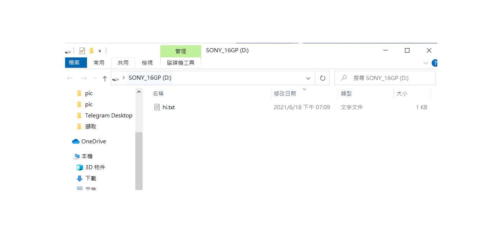

## usb掛載到linux 

執行lsblk確認是否有掛載    
```
[root@localhost user]# lsblk
NAME            MAJ:MIN RM  SIZE RO TYPE MOUNTPOINT
sda               8:0    0   50G  0 disk 
├─sda1            8:1    0    1G  0 part /boot
└─sda2            8:2    0   49G  0 part 
  ├─centos-root 253:0    0   47G  0 lvm  /
  └─centos-swap 253:1    0    2G  0 lvm  [SWAP]
sdb               8:16   0  800M  0 disk 
└─sdb1            8:17   0  799M  0 part 
sdc               8:32   1 14.5G  0 disk 
└─sdc1            8:33   1 14.5G  0 part /run/media/user/SONY_16GP
sr0              11:0    1 58.3M  0 rom  /run/media/user/VBox_GAs_6.1.18

```   
確定他掛載到我的sdc  
執行  
umount /run/media/user/SONY_16GP 
把它原本的掛載解除  
執行  
mount /dev/sdb1 /mnt  
掛載到我們要的地方  
cd /mnt  
移動到掛載的位置  
echo "hi" > hi.txt  
建立一個hi.txt  
把虛擬機關掉  
```
[root@localhost user]# umount /run/media/user/SONY_16GP 
[root@localhost user]# mount /dev/sdc1 /mnt
[root@localhost user]# cd /mnt
[root@localhost mnt]# ls
System Volume Information
[root@localhost mnt]# echo "hi" > hi.txt
``` 
確認usb內有檔案存在，成功  

## 補充  
mount 只是臨時性的  
umount 不能在mount的資料夾下執行  
 
## PDF
yum install cups-pdf  
touch a  
建立一個檔案a  
gedit a  
進入編輯頁面  
點選右上角選項按鈕，點選印表機圖案  

點選右上角print即可完成   


